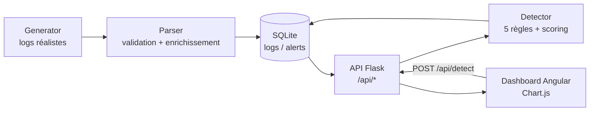

# Mini-SIEM — Système de détection d'intrusion réseau

Projet pédagogique de portfolio cybersécurité : un SIEM (Security Information
and Event Management) simplifié qui ingère des logs réseau, les enrichit,
applique des règles de détection inspirées de cas réels (brute force, scan de
ports, exfiltration, accès à des services critiques, IP malveillantes connues)
et restitue le tout dans un dashboard Angular temps réel.

L'objectif du projet est de démontrer, sur un périmètre volontairement
restreint, des compétences à la fois **SOC/analyse de sécurité** (règles de
détection, scoring de risque, mapping MITRE ATT&CK, rédaction de rapport
d'incident) et **développement full-stack** (API Flask, frontend Angular,
conteneurisation Docker, tests automatisés).

## Architecture



## Stack technique

| Domaine        | Technologies |
|-----------------|--------------|
| Backend         | Python 3.11, Flask 3, Flask-CORS, Gunicorn |
| Base de données | SQLite |
| Frontend        | Angular 21 (standalone components), Chart.js, RxJS |
| Tests           | Pytest (backend), Vitest via `@angular/build:unit-test` (frontend) |
| DevOps          | Docker, Docker Compose, python-dotenv |
| Sécurité        | Détection basée sur règles (IDS-like), scoring de risque, mapping MITRE ATT&CK, clé API |

## Aperçu


## Installation et lancement (Docker Compose)

Prérequis : Docker et Docker Compose.

1. Copier le fichier d'environnement à la racine du projet et adapter les valeurs :
   ```bash
   cp .env.example .env
   ```
   C'est ce fichier `.env` **racine** (à côté de `docker-compose.yml`) que Docker
   Compose lit pour renseigner les variables du service `backend` — éditer
   `backend/.env` n'a aucun effet sur le déploiement Docker (voir plus bas).
   Variables principales :
   - `CORS_ORIGINS` : origines autorisées, séparées par des virgules (défaut `http://localhost:4200`)
   - `API_KEY` : clé requise en header `X-API-Key` pour les endpoints d'écriture — **à changer** avant tout usage partagé
   - `FLASK_DEBUG` : `True`/`False`, ne jamais activer en production

   `PORT` et `DB_PATH` sont fixés directement dans `docker-compose.yml` (respectivement
   `5000` et `/app/data/siem.db`, ce dernier monté depuis `./backend/data`) et ne se
   configurent pas via ce `.env`.

2. Lancer l'ensemble des services :
   ```bash
   docker compose up --build
   ```
   - Backend accessible sur `http://localhost:5000`
   - Frontend accessible sur `http://localhost:4200`
   - Healthcheck backend : `GET http://localhost:5000/api/health`

3. Générer des données de démonstration (optionnel) :
   ```bash
   cd backend && python seed_logs_v2.py
   ```

### Lancement sans Docker

Pour ce mode, la configuration se fait via `backend/.env` (chargé par
`python-dotenv`) plutôt que le `.env` racine :
```bash
cp backend/.env.example backend/.env
```

```bash
# Backend (dev)
cd backend
pip install -r requirements.txt
python app.py

# Backend (production)
gunicorn -w 4 -b 0.0.0.0:5000 app:app

# Frontend
cd frontend
npm install
ng serve
```

### Authentification API

Les endpoints d'écriture (`POST /api/logs`, `POST /api/alerts`, `PATCH
/api/alerts/<id>/resolve`, `DELETE /api/alerts/<id>`, `POST /api/detect`)
exigent un header `X-API-Key` correspondant à la variable d'environnement
`API_KEY`. Une requête sans clé, ou avec une clé invalide, reçoit une réponse
`401 { "error": "..." }`. Les endpoints de lecture (`GET /api/logs`,
`GET /api/alerts`, `GET /api/stats*`, `GET /api/search`) restent ouverts pour
faciliter la démonstration.

Exemple :
```bash
curl -X POST http://localhost:5000/api/detect \
  -H "X-API-Key: change-me" \
  -H "Content-Type: application/json" \
  -d '{"window_minutes": 60}'
```

## Détection & MITRE ATT&CK

Chaque règle de détection est associée à une technique du framework
[MITRE ATT&CK](https://attack.mitre.org/), retournée dans le champ `mitre` de
chaque alerte produite par `POST /api/detect`. Le moteur implémente 5 règles ;
la règle "accès à un service critique" couvre 3 ports (Telnet/SMB/RDP),
détaillés ci-dessous chacun sur sa propre ligne.

| Règle                          | Déclencheur                                             | Sévérité | Technique MITRE ATT&CK |
|---------------------------------|----------------------------------------------------------|----------|--------------------------|
| Brute Force SSH                 | ≥ 5 tentatives DENY sur le port 22 depuis une même IP     | CRITICAL | T1110 — Brute Force (Credential Access) |
| Port Scan                       | ≥ 8 ports distincts DENY depuis une même IP               | HIGH     | T1595 — Active Scanning (Reconnaissance) |
| Volume Anormal (exfiltration)   | > 1 Mo cumulé en ALLOW depuis une même IP                 | HIGH     | T1041 — Exfiltration Over C2 Channel (Exfiltration) |
| Accès Telnet Critique           | DENY sur le port 23 (Telnet)                              | CRITICAL | T1021 — Remote Services (Lateral Movement) |
| Accès SMB Critique              | DENY sur le port 445 (SMB)                                 | CRITICAL | T1021.002 — Remote Services: SMB/Windows Admin Shares |
| Accès RDP Critique              | DENY sur le port 3389 (RDP)                                | CRITICAL | T1021.001 — Remote Services: RDP |
| IP Malveillante Connue          | Trafic observé depuis une IP de la liste `KNOWN_BAD_IPS`   | HIGH     | T1590 — Gather Victim Network Information (Reconnaissance) |

Un exemple complet d'analyse d'incident (alerte Brute Force SSH) est disponible
dans [`docs/rapport-incident-exemple.md`](docs/rapport-incident-exemple.md).

## Tests

```bash
# Backend
cd backend
pytest

# Frontend
cd frontend
ng test
```

## Limites connues

Ce projet est **pédagogique** et n'est pas destiné à un usage en production :
- Les logs sont générés/simulés (ou saisis via l'API) — il n'y a pas de vraie
  ingestion réseau (pas d'agent, pas de capture de trafic, pas de syslog).
- Les règles de détection sont simples (seuils fixes, fenêtre glissante) et
  ne remplacent pas un moteur de corrélation avancé.
- SQLite n'est pas conçu pour de forts volumes ou de la concurrence élevée.
- L'authentification est une clé API unique partagée, sans gestion
  d'utilisateurs, de rôles ni de rotation automatique.
- Pas de chiffrement TLS configuré par défaut (à ajouter via un reverse proxy
  en déploiement réel).
- Le frontend appelle directement l'API backend exposée sur son port ; il n'y
  a pas de reverse proxy nginx pour `/api` dans l'image frontend actuelle.

## Pistes d'évolution

- Intégration à un vrai SIEM/EDR (Wazuh, ELK/Elastic Security) pour une
  ingestion et une corrélation à l'échelle.
- Alerting temps réel via WebSockets ou Server-Sent Events plutôt que du
  polling côté frontend.
- Migration vers une base de données plus robuste (PostgreSQL, éventuellement
  TimescaleDB pour les séries temporelles).
- Authentification utilisateur multi-rôle (analyste / admin) avec JWT plutôt
  qu'une clé API partagée.
- Détection par apprentissage automatique (anomalies statistiques) en
  complément des règles à seuils fixes.
- Enrichissement des IP par des flux de threat intelligence externes
  (réputation, géolocalisation) au lieu d'une liste statique.
