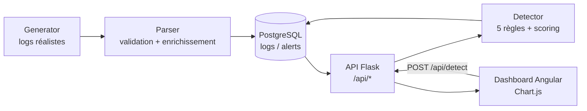

# Mini-SIEM — Système de détection d'intrusion réseau

Projet pédagogique de portfolio cybersécurité : un SIEM (Security Information
and Event Management) simplifié qui ingère des logs réseau, les enrichit,
applique des règles de détection inspirées de cas réels (brute force, scan de
ports, exfiltration, accès à des services critiques, IP malveillantes connues)
et restitue le tout dans un dashboard Angular temps réel.

L'objectif du projet est de démontrer, sur un périmètre volontairement
restreint, des compétences à la fois **SOC/analyse de sécurité** (règles de
détection, scoring de risque, mapping MITRE ATT&CK, rédaction de rapport
d'incident) et **développement full-stack** (API Flask, frontend Angular,
conteneurisation Docker, tests automatisés).

## Architecture



## Stack technique

| Domaine        | Technologies |
|-----------------|--------------|
| Backend         | Python 3.11, Flask 3, Flask-CORS, Gunicorn |
| Base de données | PostgreSQL 16 |
| Frontend        | Angular 21 (standalone components), Chart.js, RxJS |
| Tests           | Pytest (backend), Vitest via `@angular/build:unit-test` (frontend) |
| DevOps          | Docker, Docker Compose, python-dotenv |
| Sécurité        | Détection basée sur règles (IDS-like), scoring de risque, mapping MITRE ATT&CK, clé API |

## Aperçu


## Installation et lancement (Docker Compose)

Prérequis : Docker et Docker Compose.

1. Copier le fichier d'environnement à la racine du projet et adapter les valeurs :
   ```bash
   cp .env.example .env
   ```
   C'est ce fichier `.env` **racine** (à côté de `docker-compose.yml`) que Docker
   Compose lit pour renseigner les variables du service `backend` — éditer
   `backend/.env` n'a aucun effet sur le déploiement Docker (voir plus bas).
   Variables principales :
   - `CORS_ORIGINS` : origines autorisées, séparées par des virgules (défaut `http://localhost:4200`)
   - `API_KEY` : clé requise en header `X-API-Key` pour les endpoints d'écriture — **à changer** avant tout usage partagé
   - `FLASK_DEBUG` : `True`/`False`, ne jamais activer en production
   - `POSTGRES_DB` / `POSTGRES_USER` / `POSTGRES_PASSWORD` : identifiants de la base
     PostgreSQL (service `postgres` du compose) — **à changer** avant tout usage partagé

   `PORT` et `POSTGRES_HOST` (`postgres`, le nom du service) sont fixés directement
   dans `docker-compose.yml` et ne se configurent pas via ce `.env`.

2. Lancer l'ensemble des services :
   ```bash
   docker compose up --build
   ```
   - Backend accessible sur `http://localhost:5000`
   - Frontend accessible sur `http://localhost:4200`
   - Healthcheck backend : `GET http://localhost:5000/api/health`

3. Générer des données de démonstration (optionnel) :
   ```bash
   cd backend && python seed_logs_v2.py
   ```

### Lancement sans Docker

Pour ce mode, la configuration se fait via `backend/.env` (chargé par
`python-dotenv`) plutôt que le `.env` racine :
```bash
cp backend/.env.example backend/.env
```

```bash
# Backend (dev)
cd backend
pip install -r requirements.txt
python app.py

# Backend (production)
gunicorn -w 4 -b 0.0.0.0:5000 app:app

# Frontend
cd frontend
npm install
ng serve
```

### Authentification JWT multi-rôle (2026-09-13)

Remplace l'ancienne clé API unique partagée. Deux rôles :
- **analyst** : ingérer des logs (`POST /api/logs`), lancer une détection
  (`POST /api/detect`, `POST /api/detect/ml`), résoudre des alertes
- **admin** : tout ce que peut faire *analyst*, plus supprimer des alertes
  (`DELETE /api/alerts/<id>`) et gérer les comptes (`/api/auth/users`)

Un compte admin est créé automatiquement au premier démarrage (variables
`ADMIN_USERNAME`/`ADMIN_PASSWORD`, **à changer** avant tout usage partagé).
Les endpoints de lecture (`GET /api/logs`, `GET /api/alerts`, `GET
/api/stats*`, `GET /api/search`) restent ouverts pour faciliter la démo.

```bash
# 1. Connexion -> token JWT (valide JWT_EXPIRY_HOURS, défaut 8h)
curl -X POST http://localhost:5000/api/auth/login \
  -H "Content-Type: application/json" \
  -d '{"username": "admin", "password": "change-me"}'

# 2. Utiliser le token
curl -X POST http://localhost:5000/api/detect \
  -H "Authorization: Bearer <token>" \
  -H "Content-Type: application/json" \
  -d '{"window_minutes": 60}'
```

Le frontend Angular a un écran de connexion (`app/login/`) ; le token est
stocké en `localStorage` et joint automatiquement aux requêtes protégées
(`services/auth.service.ts`). Le bouton "Supprimer" sur une alerte n'apparaît
que pour un compte `admin`.

**Testé et vérifié** : 3 nouveaux tests unitaires (login refusé/accepté,
rôle `analyst` bloqué en `403` sur `DELETE /api/alerts`), et un test manuel
complet dans un vrai navigateur (Chrome piloté) : connexion → dashboard
affiché → clic "Lancer la détection" avec le JWT (pas de 401/403 en
console) → déconnexion → retour automatique à l'écran de connexion,
`localStorage` vidé.

## Détection & MITRE ATT&CK

Chaque règle de détection est associée à une technique du framework
[MITRE ATT&CK](https://attack.mitre.org/), retournée dans le champ `mitre` de
chaque alerte produite par `POST /api/detect`. Le moteur implémente 5 règles ;
la règle "accès à un service critique" couvre 3 ports (Telnet/SMB/RDP),
détaillés ci-dessous chacun sur sa propre ligne.

| Règle                          | Déclencheur                                             | Sévérité | Technique MITRE ATT&CK |
|---------------------------------|----------------------------------------------------------|----------|--------------------------|
| Brute Force SSH                 | ≥ 5 tentatives DENY sur le port 22 depuis une même IP     | CRITICAL | T1110 — Brute Force (Credential Access) |
| Port Scan                       | ≥ 8 ports distincts DENY depuis une même IP               | HIGH     | T1595 — Active Scanning (Reconnaissance) |
| Volume Anormal (exfiltration)   | > 1 Mo cumulé en ALLOW depuis une même IP                 | HIGH     | T1041 — Exfiltration Over C2 Channel (Exfiltration) |
| Accès Telnet Critique           | DENY sur le port 23 (Telnet)                              | CRITICAL | T1021 — Remote Services (Lateral Movement) |
| Accès SMB Critique              | DENY sur le port 445 (SMB)                                 | CRITICAL | T1021.002 — Remote Services: SMB/Windows Admin Shares |
| Accès RDP Critique              | DENY sur le port 3389 (RDP)                                | CRITICAL | T1021.001 — Remote Services: RDP |
| IP Malveillante Connue          | IP observée dans le flux de threat intel externe (voir ci-dessous) | HIGH | T1590 — Gather Victim Network Information (Reconnaissance) |

Un exemple complet d'analyse d'incident (alerte Brute Force SSH) est disponible
dans [`docs/rapport-incident-exemple.md`](docs/rapport-incident-exemple.md).

## Threat Intelligence externe (2026-09-13)

La règle "IP Malveillante Connue" utilisait une liste statique de 3 IP
(`KNOWN_BAD_IPS`, conservée comme repli). Remplacée par un flux public
réellement interrogé : [blocklist.de](https://lists.blocklist.de/lists/all.txt)
"all.txt" — IP ayant récemment attaqué des serveurs/honeypots, signalées par
la communauté, **aucune authentification requise**, ~28 000 IP en pratique.

**Implémentation** ([`backend/threat_intel.py`](backend/threat_intel.py)) :
- Mis en cache en mémoire process avec un TTL (`THREAT_INTEL_TTL_SECONDS`,
  défaut 1h) pour éviter de retélécharger ~28 000 lignes à chaque détection
- Repli automatique sur la liste statique si le flux est indisponible
  (réseau, timeout, format inattendu) — la détection ne doit jamais casser
  faute de threat intel externe
- `detector.py::rule_known_bad_ip` interroge les IP *observées* dans la
  fenêtre analysée (généralement peu nombreuses) et teste leur appartenance
  à l'ensemble (lookup O(1)), plutôt que l'inverse (boucler sur ~28 000 IP
  contre la base à chaque exécution, bien trop lent)
- `GET /api/threat-intel/status` expose la source utilisée et le nombre d'IP

**Benchmark réel** ([`backend/benchmark_threat_intel.py`](backend/benchmark_threat_intel.py))
comparant l'implémentation initiale (une requête SQL par IP de la liste) à
l'implémentation actuelle, sur le vrai flux (25 961 IP le jour du test) et
503 logs en base (dont 3 correspondant à de vraies IP malveillantes du
flux) : **13,379 s → 0,025 s, soit ×539**, avec exactement les mêmes 3
correspondances trouvées dans les deux cas (assertion automatique dans le
script). Le facteur exact dépend du nombre d'IP dans le flux ce jour-là et
du volume de logs — reproductible via `python benchmark_threat_intel.py`
(nécessite `POSTGRES_*` et une connexion réseau).

**Testé et vérifié** : `GET /api/threat-intel/status` renvoie
`{"count": 28078, "source": "https://lists.blocklist.de/lists/all.txt", "using_fallback": false}`
en conditions réelles (Minikube, via l'Ingress) ; une vraie IP piochée dans le
flux du jour, injectée dans un log puis `POST /api/detect`, déclenche
effectivement l'alerte "IP Malveillante Connue" citant cette IP et la source.
3 tests automatisés couvrent le fetch réel, le cache (mock vérifiant qu'aucun
appel réseau n'est refait), et le repli sur panne réseau simulée
(`backend/tests/test_threat_intel.py`).

## Détection d'anomalies par ML (2026-09-13)

Complète les 5 règles à seuils fixes avec une approche statistique :
[`backend/ml_detector.py`](backend/ml_detector.py) utilise un
`IsolationForest` (scikit-learn) qui apprend un profil "normal" de
comportement par IP source sur la fenêtre analysée (nombre d'événements,
ports distincts ciblés, volume de données, ratio de refus), puis signale les
IP dont le profil s'écarte significativement des autres.

```bash
curl -X POST http://localhost:5000/api/detect/ml \
  -H "Authorization: Bearer <token>" \
  -H "Content-Type: application/json" \
  -d '{"window_minutes": 60, "contamination": 0.1}'
```

**Limite assumée** : modèle non supervisé entraîné à la volée sur chaque
fenêtre (pas un modèle pré-entraîné et versionné) — cohérent avec l'échelle
pédagogique du projet, pas la manière dont ça se ferait en production
(entraînement offline périodique, modèle sauvegardé, dérive surveillée). Un
garde-fou (`MIN_SAMPLES = 5`) évite de renvoyer un résultat statistiquement
non fiable quand trop peu d'IP distinctes sont présentes dans la fenêtre.

**Testé et vérifié** : scénario avec 6 IP au comportement similaire (peu
d'événements, un seul port, peu de volume) + 1 IP nettement différente
(31-41 événements, autant de ports distincts, volume ×1000) — l'IP atypique
est correctement isolée avec un score d'anomalie négatif, dans un conteneur
Docker isolé puis en conditions réelles sur Minikube via l'Ingress. Vérifié
aussi qu'avec moins de 5 IP distinctes, l'endpoint renvoie `0` alerte plutôt
qu'un résultat statistiquement non fiable.

## Scan de sécurité (Trivy, 2026-09-19)

Premier scan avec [Trivy](https://trivy.dev/) (image `aquasec/trivy:latest`) du
dépôt, exécuté en local puis ajouté à la CI (job `security-scan`, non bloquant
pour le déploiement : `exit-code: 0`, à passer à `1` une fois les findings
HIGH/CRITICAL traités).

**Dépendances (`trivy fs`)** : 0 secret détecté ; 30 vulnérabilités dont 11 HIGH.
- Backend (`requirements.txt`) : 3 HIGH — `PyJWT 2.9.0` (2 CVE, corrigé en 2.12.0 / 2.13.0)
  et `flask-cors 4.0.1` (CVE-2024-6221, corrigé en 4.0.2).
- Frontend (`package-lock.json`) : 8 HIGH, toutes sur `@angular/common`,
  `@angular/compiler` et `@angular/core` 21.2.10 (corrigées dans 21.2.19).

**Configuration (`trivy config`)** — Terraform (`terraform/main.tf`), 5 findings :
- CRITICAL `AWS-0104` : egress du security group ouvert vers toute IP
- HIGH `AWS-0107` : SSH (22) ouvert à `0.0.0.0/0`
- HIGH `AWS-0028` : IMDSv2 non exigé sur l'instance EC2
- HIGH `AWS-0131` : volume racine non chiffré
- LOW `AWS-0124` : règle de security group sans description

Dockerfiles : conteneurs exécutés en `root` (`DS-0002`, HIGH) pour le backend et
le frontend. Manifests Kubernetes : pas de `securityContext` (root, système de
fichiers racine en écriture, pas de limites CPU/mémoire) sur tous les
Deployments. Ces findings sont connus et non corrigés à ce stade.

```bash
docker run --rm -v "$PWD:/src:ro" aquasec/trivy:latest fs --scanners vuln,secret --skip-dirs /src/frontend/node_modules /src
docker run --rm -v "$PWD:/src:ro" aquasec/trivy:latest config --skip-dirs /src/frontend/node_modules /src
```

## Tests

```bash
# Backend
cd backend
pytest

# Frontend
cd frontend
ng test
```

## CI/CD

Pipeline GitHub Actions défini dans [`.github/workflows/ci-cd.yml`](.github/workflows/ci-cd.yml).

**Déclencheurs :**
- `push` sur `main` : exécute les tests puis déploie automatiquement
- `pull_request` vers `main` : exécute les tests uniquement (pas de déploiement)

**Jobs :**
1. `backend-tests` — installe les dépendances Python 3.11, lance `pytest` (22 tests)
2. `frontend-tests` — installe les dépendances Node 20, lance `ng test --no-watch` (7 tests)
3. `deploy` — ne s'exécute que si les deux jobs de tests précédents réussissent **et** que le déclencheur est un push sur `main` (pas sur une pull request). Se connecte en SSH à l'instance EC2 cible et exécute `git pull` + `docker compose up -d --build`.

**Cible de déploiement :** une instance EC2 unique (`t2.micro`, Ubuntu 22.04, éligible AWS Free Tier), avec Docker et Docker Compose installés manuellement une fois. Le pipeline ne provisionne pas l'infrastructure (pas de Terraform à ce stade) : il se contente de mettre à jour le code et de reconstruire les conteneurs sur une instance déjà existante, via SSH (action [`appleboy/ssh-action`](https://github.com/appleboy/ssh-action)).

**Secrets GitHub requis** (Settings → Secrets and variables → Actions) :
- `EC2_HOST` — IP publique de l'instance
- `EC2_USER` — utilisateur SSH (`ubuntu`)
- `EC2_SSH_KEY` — clé privée SSH associée à la paire de clés EC2

**Configuration côté serveur :** un fichier `.env` (non versionné, contenant `API_KEY`/`CORS_ORIGINS` propres à l'instance) est présent directement dans `~/app/` sur l'EC2 — il n'est pas géré par le pipeline et doit être créé manuellement lors du premier déploiement.

**Correction (2026-09-13) :** le script de déploiement SSH n'utilisait pas
`set -e` — un `docker compose build` en échec (disque plein sur l'EC2, voir
section Terraform) n'a pas fait échouer le step, et le job `deploy` a été
rapporté `success` alors que les conteneurs n'avaient pas été recréés.
`set -e` ajouté en première ligne du script pour que ce type d'échec
partiel remonte désormais correctement.

**Limites actuelles :**
- Une seule instance, sans haute disponibilité ni rollback automatique en cas d'échec du déploiement.
- Pas de registre d'images (le build Docker se fait directement sur l'instance cible).
- Pas de HTTPS/reverse proxy en amont (accès direct sur les ports 4200/5000).

## Kubernetes (Minikube, local)

Manifests dans [`k8s/`](k8s/) — orchestration locale de la même application que le
`docker-compose.yml`, sans lien avec le déploiement EC2/GitHub Actions ci-dessus
(cluster local, pas de cluster managé payant).

**Ressources créées** (vérifiées via `kubectl get pods,svc,deploy,pvc,ingress`) :
- 3 `Deployment` (1 replica chacun) : `backend`, `frontend`, `postgres`
- 3 `Service` ClusterIP : `backend` (5000), `frontend` (80), `postgres` (5432)
- 1 `ConfigMap` (`mini-siem-config`) : variables non sensibles (`PORT`,
  `POSTGRES_HOST/PORT/DB/USER`, `CORS_ORIGINS`, `FLASK_DEBUG`, `WAZUH_*` non secrets)
- 1 `Secret` (`mini-siem-secret`) : `API_KEY`, `WAZUH_PASSWORD`, `POSTGRES_PASSWORD`
  — **non commité**, voir `k8s/secret.example.yaml` comme modèle
- 1 `PersistentVolumeClaim` (`postgres-data`, 500 Mi) : stockage des données
  PostgreSQL, monté sur `/var/lib/postgresql/data` dans le pod `postgres`
- 1 `Ingress` (`mini-siem-ingress`, classe `nginx`) : route `/` vers `frontend`,
  `/api` vers `backend`

Le pod `backend` a un `initContainer` (`wait-for-postgres`, `pg_isready` en
boucle) qui bloque son démarrage tant que Postgres n'accepte pas de connexions
— l'équivalent du `depends_on: condition: service_healthy` de docker-compose,
qui n'a pas d'équivalent direct côté Kubernetes.

**Lancer le cluster local :**
```bash
minikube start --driver=docker
minikube addons enable ingress
```

**Construire les images pour Minikube** (le cluster local a son propre registre
d'images, distinct du Docker de l'hôte) :
```bash
docker build -t minisiem-backend:k8s ./backend
docker build -t minisiem-frontend:k8s ./frontend
minikube image load minisiem-backend:k8s
minikube image load minisiem-frontend:k8s
```

**Déployer :**
```bash
# Créer le Secret réel (valeurs propres à l'environnement, jamais commitées)
kubectl create secret generic mini-siem-secret \
  --from-literal=API_KEY=<votre-clé> \
  --from-literal=WAZUH_PASSWORD=<votre-mot-de-passe>

kubectl apply -f k8s/configmap.yaml
kubectl apply -f k8s/postgres.yaml
kubectl apply -f k8s/backend.yaml
kubectl apply -f k8s/frontend.yaml
kubectl apply -f k8s/ingress.yaml
```

**Accéder à l'application** (le driver Docker de Minikube sur Windows/Mac n'expose
pas directement l'IP du cluster à l'hôte, un tunnel ou port-forward est nécessaire) :
```bash
# Frontend + API via l'Ingress (contrôleur ingress-nginx)
kubectl port-forward -n ingress-nginx svc/ingress-nginx-controller 8080:80
# -> http://localhost:8080/         (frontend)
# -> http://localhost:8080/api/health (backend)

# Ou directement sur les Services, pour reproduire les ports du docker-compose local
kubectl port-forward svc/backend 5000:5000
kubectl port-forward svc/frontend 4200:80
```

**Testé et vérifié le 2026-09-13 :** les deux pods démarrent `Running` (1/1) sans
redémarrage, le `PersistentVolumeClaim` passe à l'état `Bound`, et les trois modes
d'accès ci-dessus renvoient `200` sur `/` et `/api/health`.

**Correction apportée (2026-09-13) :** le frontend appelait initialement une URL
d'API absolue (`http://localhost:5000/api`), ce qui contournait la règle Ingress
`/api`. Corrigé : `environment.prod.ts` utilise désormais une URL relative
(`/api`), et l'image nginx du frontend embarque un reverse proxy
([`frontend/nginx.conf.template`](frontend/nginx.conf.template)) qui relaie
`/api/*` vers le Service `backend:5000` (variable `BACKEND_HOST`, surchageable).
Revérifié : `/api/health` renvoie `200` à la fois via l'Ingress et via le
Service `frontend` accédé directement (sans passer par la règle Ingress `/api`),
confirmant que c'est bien le proxy nginx du pod qui relaie la requête, pas
seulement la route Ingress. Ce même correctif profite aussi au déploiement
EC2/docker-compose (pas d'Ingress là-bas) : le frontend nginx y relaie
désormais aussi `/api` vers le conteneur `backend`, au lieu de dépendre d'un
port 5000 exposé séparément sur l'hôte.

**Bug trouvé et corrigé après un déploiement EC2 (2026-09-13) :** un déploiement
qui ne modifiait que le backend (image reconstruite, conteneur recréé avec une
nouvelle IP Docker) sans toucher au frontend a cassé `/api/*` en `502` — nginx
résout `proxy_pass` **une seule fois au démarrage** par défaut, donc le
frontend (resté en place, non redémarré) gardait en cache l'ancienne IP,
maintenant morte. Corrigé avec un `resolver` + une variable dans `proxy_pass`
(force une résolution DNS à chaque requête), configuré via le mécanisme
officiel de l'image `nginx:alpine` (`NGINX_ENTRYPOINT_LOCAL_RESOLVERS=1` →
variable `NGINX_LOCAL_RESOLVERS` lue depuis `/etc/resolv.conf`, portable entre
Docker Compose et Kubernetes — préféré à une IP de résolveur codée en dur type
`127.0.0.11`, spécifique à Docker et invalide sous Kubernetes). Piège annexe
rencontré en cours de route : avec une variable dans `proxy_pass`, nginx ne
réécrit **pas** le préfixe de location (`/api/`) — y répéter `/api/`
provoquait un double préfixe et un 404 côté Flask ; corrigé en laissant nginx
transmettre `$request_uri` tel quel. Et en Kubernetes spécifiquement : le
`resolver` nginx ne suit pas les domaines de recherche de `/etc/resolv.conf`
(contrairement à la résolution système) — `backend` seul échouait
(`could not be resolved`), il faut le FQDN complet du Service
(`backend.default.svc.cluster.local`, surchargé via `BACKEND_HOST` dans
`k8s/frontend.yaml`). **Vérifié dans les deux environnements** : recréer le
pod/conteneur backend sans toucher au frontend renvoie bien `200` sur
`/api/health` après re-résolution (testé sur Minikube avec `kubectl delete
pod -l app=backend`, et en local avec `docker rm -f`+`docker run` d'un nouveau
conteneur backend).

## Infrastructure as Code (Terraform)

Fichiers dans [`terraform/`](terraform/) — reprend en code l'instance EC2 et son
security group jusqu'ici configurés manuellement dans la console AWS (voir
section CI/CD ci-dessus). Ne provisionne pas de VPC dédié : utilise le VPC et le
subnet par défaut du compte, dans les limites du Free Tier (`t3.micro`).

**Ressources gérées :**
- `aws_security_group.mini_siem` — 3 règles ingress explicites : SSH (22),
  API backend (5000), frontend (4200), toutes en `0.0.0.0/0` ; egress ouvert
- `aws_instance.mini_siem` — l'instance EC2 existante (`t3.micro`, Ubuntu,
  volume racine **20 Go** gp3)

**Incident réel et correction (2026-09-13) :** l'ajout de scikit-learn/numpy/
scipy (détection ML, voir plus bas) a fait passer la taille de l'image backend
au-delà de ce que le volume racine de 8 Go pouvait encaisser pendant le build
— `docker compose build` a échoué (`No space left on device`) sur l'instance
EC2, mais le pipeline CI/CD l'a rapporté comme `success` (le script SSH de
déploiement n'utilise pas `set -e`, donc une commande qui échoue au milieu du
script n'a pas fait échouer le step). Corrigé en deux temps : `terraform
apply` pour passer `root_block_device.volume_size` de 8 à 20 Go (mise à jour
en place, `0 to add, 1 to change, 0 to destroy`, reste dans les 30 Go inclus
au Free Tier), puis `growpart` + `resize2fs` sur l'instance pour étendre la
partition et le système de fichiers Linux (Terraform redimensionne le volume
EBS, pas la partition dessus — deux opérations distinctes). Root cause
notée pour la doc CI/CD : un script de déploiement multi-commandes sans
`set -e` peut masquer un échec partiel.

**Commandes :**
```bash
cd terraform
terraform init
terraform plan
terraform apply
```

**Comment c'est vérifié (fait le 2026-09-13) :** l'instance et le security group
existants (créés manuellement avant cette étape) ont été importés dans l'état
Terraform via `terraform import` (`aws_instance.mini_siem`,
`aws_security_group.mini_siem`), pour que le code reflète l'infra réelle sans la
recréer. Un premier `terraform plan` a révélé une règle ingress port 80 inutilisée
(héritée de la configuration manuelle initiale, jamais utilisée par
l'application qui écoute sur 4200/5000) ; `terraform apply` l'a supprimée et a
ajouté des descriptions explicites aux règles restantes — **0 ressource ajoutée,
1 modifiée (mise à jour en place, sans remplacement), 0 détruite**. Un
`terraform plan` exécuté juste après confirme `No changes. Your infrastructure
matches the configuration.` L'application est restée accessible tout du long
(`/api/health` et le frontend ont continué à répondre `200` pendant et après
l'apply) et le port 80 est bien fermé (`connection timeout` vérifié après coup).

**State distant S3 (ajouté le 2026-09-13) :** le fichier d'état est maintenant
stocké dans un bucket S3 dédié (`mini-siem-tfstate-579661925343`, région
`eu-north-1`), créé hors Terraform (problème de l'œuf et de la poule classique
pour un backend) via l'AWS CLI, avec **versioning activé**, **chiffrement par
défaut (AES256)** et **accès public entièrement bloqué**
(`put-public-access-block`). Migré avec `terraform init -migrate-state` ;
vérifié que le fichier existe bien sur S3 (`aws s3 ls`) et qu'un `terraform
plan` exécuté juste après renvoie toujours `No changes`. Reste dans les
limites du Free Tier (fichier de quelques Ko, très loin des 5 Go inclus).
Pas de verrouillage DynamoDB à ce stade (usage solo, pas de risque de
state lock concurrent pour l'instant).

**Utilisateur IAM dédié (ajouté le 2026-09-13) :** Terraform tournait jusqu'ici
avec une clé d'accès du compte **root**. Remplacé par un utilisateur IAM
dédié `mini-siem-terraform`, avec seulement deux politiques : `AmazonEC2FullAccess`
(gérée AWS) et une politique inline scopée au seul bucket d'état
(`s3:ListBucket`/`GetObject`/`PutObject`/`DeleteObject` restreints à
`mini-siem-tfstate-579661925343`). Aucun droit IAM (impossible de créer
d'autres utilisateurs ou de toucher aux credentials root). Vérifié avant
suppression : `terraform plan` avec les seules nouvelles credentials renvoie
`No changes` (lecture du state S3 + de l'infra EC2/VPC OK). **La clé root a
ensuite été supprimée** (`aws iam delete-access-key`) — confirmé morte via un
appel `sts get-caller-identity` qui renvoie `InvalidClientTokenId`.

**Limites actuelles :**
- Le nom et l'AMI/subnet de l'instance sont volontairement figés sur les valeurs
  déjà existantes (les changer forcerait Terraform à recréer la ressource) —
  ce n'est donc pas encore un module 100 % reproductible from scratch sur un
  compte AWS vierge sans adaptation des variables.
- `AmazonEC2FullAccess` reste une politique large (tout EC2, pas seulement
  cette instance) — suffisant pour un projet solo, à restreindre avec une
  politique sur-mesure (ARN de ressource explicite) pour un usage en équipe.

## Monitoring (Prometheus + Grafana, sur le même cluster Minikube)

Manifests dans [`k8s/monitoring/`](k8s/monitoring/) — déployés sur le cluster
Minikube utilisé pour l'orchestration Kubernetes ci-dessus (aucun lien avec
l'EC2/Terraform : monitoring local uniquement à ce stade).

**Backend instrumenté** ([`backend/metrics.py`](backend/metrics.py), lib.
`prometheus-client`) — endpoint `GET /metrics` exposant :
- `http_requests_total{method,endpoint,status}` — compteur de requêtes HTTP
- `http_request_duration_seconds{method,endpoint}` — histogramme de latence
- `alerts_generated_total{rule_name,severity}` — compteur d'alertes produites
  par le moteur de détection, incrémenté à chaque `POST /api/detect`

**Ressources créées :**
- 1 `Deployment` + `Service` Prometheus (port 9090), config via `ConfigMap`
  (scrape du `Service` `backend` sur `/metrics`, règles d'alerte incluses)
- 1 `Deployment` + `Service` Grafana (port 3000), avec provisioning automatique
  (via `ConfigMap`) d'une datasource Prometheus et d'un dashboard "Mini-SIEM"
- 1 `Secret` (`grafana-admin`) pour le mot de passe admin Grafana — non commité

**Dashboard Grafana "Mini-SIEM"** (4 panels, provisionnés automatiquement) :
requêtes HTTP/s par endpoint, latence p95, alertes générées cumulées par règle,
statut `up` du backend.

**Alertes Prometheus configurées** (`k8s/monitoring/prometheus-config.yaml`) :
- `BackendDown` — `up{job="backend"} == 0` pendant 30s
- `HighCriticalAlertRate` — plus de 3 alertes CRITICAL sur 5 minutes

**Déployer :**
```bash
kubectl create secret generic grafana-admin --from-literal=password=<votre-mdp>
kubectl apply -f k8s/monitoring/prometheus-config.yaml
kubectl apply -f k8s/monitoring/prometheus.yaml
kubectl apply -f k8s/monitoring/grafana-provisioning.yaml
kubectl apply -f k8s/monitoring/grafana.yaml
```

**Accéder :**
```bash
kubectl port-forward svc/prometheus 9090:9090   # http://localhost:9090
kubectl port-forward svc/grafana 3000:3000      # http://localhost:3000 (admin / <votre-mdp>)
```

**Testé et vérifié le 2026-09-13 :**
- `GET /metrics` sur le backend renvoie bien les 3 métriques ci-dessus
- Prometheus scrape le backend avec succès (`up{job="backend"} == 1`, cible
  `health: up` dans `/api/v1/targets`)
- Après avoir mis le backend à l'échelle 0 (`kubectl scale deploy/backend
  --replicas=0`), la règle `BackendDown` est passée de `inactive` → `pending`
  → **`firing`** en ~50s (30s de `for:` + latence de scrape), confirmée via
  `/api/v1/rules` — puis revenue à `inactive` après remise à l'échelle
- La datasource Prometheus et le dashboard "Mini-SIEM" apparaissent bien dans
  l'API Grafana (`/api/datasources`, `/api/search`)
- Après injection de logs de brute-force SSH + `POST /api/detect`, la requête
  PromQL `sum by (rule_name) (alerts_generated_total)` renvoie une valeur réelle
  (`Brute Force SSH: 1`) — confirmant que le panel correspondant du dashboard
  affiche des données, pas un graphe vide

**Stockage persistant (ajouté le 2026-09-13) :** Prometheus utilise désormais un
`PersistentVolumeClaim` (`prometheus-data`, 1 Gi) monté sur `/prometheus`, avec
`fsGroup: 65534` pour que le process non-root du conteneur puisse y écrire.
Vérifié : suppression manuelle du pod (`kubectl delete pod -l app=prometheus`)
→ le nouveau pod recréé par le Deployment retrouve les mêmes fichiers WAL
(`ls /prometheus/wal` identique avant/après), confirmant que l'historique des
métriques survit bien à un redémarrage.

**Alertmanager (ajouté le 2026-09-13) :** déployé sur le même cluster
(`k8s/monitoring/alertmanager.yaml`), câblé à Prometheus via
`alerting.alertmanagers` dans la config Prometheus. Le receiver configuré
pointe vers `alert-sink` (`k8s/monitoring/alert-sink.yaml`, image
`mendhak/http-https-echo`), un récepteur webhook de démonstration qui loggue
chaque notification reçue — à remplacer par un vrai récepteur (email/Slack/
PagerDuty) en usage réel. **Vérifié de bout en bout :** `up{job="backend"}` →
0 (`kubectl scale deploy/backend --replicas=0`) → règle `BackendDown` passe à
`firing` → Alertmanager envoie le webhook → `kubectl logs deploy/alert-sink`
confirme la réception d'un `POST /webhook HTTP/1.1 200` avec le payload complet
de l'alerte (`alertname: BackendDown`, labels, annotations).

**Note technique (rencontrée pendant ce test) :** les `Deployment` `backend` et
`prometheus` montent chacun un `PersistentVolumeClaim` en `ReadWriteOnce`. Avec
la stratégie de déploiement par défaut (`RollingUpdate`), un `kubectl apply`
qui modifie le pod tente de démarrer le nouveau avant d'arrêter l'ancien, et
échoue à monter le volume déjà pris (`lock DB directory: resource temporarily
unavailable` côté Prometheus). Corrigé en passant les deux `Deployment` en
stratégie `Recreate`.

**Limites actuelles :**
- Dashboard limité à 4 panels de base ; pas encore de vue dédiée par règle de
  détection ou par IP source.
- Le récepteur Alertmanager est un webhook de démonstration (logs uniquement),
  pas une vraie destination de notification (email/Slack).

## Base de données (migration SQLite → PostgreSQL, 2026-09-13)

Le projet utilisait initialement SQLite (fichier unique, pas de service
séparé). Migré vers PostgreSQL 16, disponible comme service dans
`docker-compose.yml`, `k8s/postgres.yaml`, et dans le pipeline CI (service
Postgres éphémère pour les tests).

**Choix d'implémentation :** le code applicatif (`routes/*.py`, `detector.py`)
était écrit contre l'API `sqlite3` — placeholders `?`, `conn.execute(...)`
directement sur la connexion, `cursor.lastrowid` après un `INSERT`. Plutôt que
réécrire chacun des ~40 sites d'appel pour l'API `psycopg2` (placeholders
`%s`, exécution uniquement via un curseur, pas de `lastrowid`),
[`backend/database.py`](backend/database.py) fournit un fin adaptateur qui
traduit ces appels vers `psycopg2` (`?` → `%s`, ajout automatique de
`RETURNING id` sur les `INSERT`, `dict(row)` toujours utilisable). C'est un
compromis assumé : moins de risque de régression sur la logique métier
existante en échange d'une petite couche de traduction à maintenir — un ORM
(SQLAlchemy) serait le choix standard pour un projet plus large.

**Différence sémantique trouvée et corrigée pendant la migration :** SQLite
autorise `HAVING <alias_de_select>` (ex. `HAVING total_bytes > 1000000` avec
`SUM(bytes) AS total_bytes` dans le `SELECT`) ; PostgreSQL, conforme au
standard SQL, ne le permet pas et lève `UndefinedColumn`. Corrigé dans les 3
règles de détection concernées (`detector.py`) en répétant l'expression
agrégée dans le `HAVING` (`HAVING SUM(bytes) > 1000000`, etc.).

**Testé et vérifié :** les 22 tests backend passent contre une vraie instance
PostgreSQL (service Docker en local, puis service Postgres dans le job CI) ;
vérifié manuellement `INSERT`/`SELECT`/`lastrowid`, puis un scénario complet
`POST /api/logs` × 7 → `POST /api/detect` → alerte "Brute Force SSH" bien
générée (confirme que l'adaptateur, le `GROUP BY`/`HAVING` corrigé et
`lastrowid` fonctionnent ensemble bout en bout).

**Limites actuelles :**
- L'adaptateur `?` → `%s` est une traduction naïve (`str.replace`) : sans
  risque ici (le jeu de requêtes du projet ne contient aucun `?` littéral
  hors paramètre), mais pas un parseur SQL général.
- Pas de migrations versionnées (Alembic ou équivalent) : le schéma est créé
  par un unique `CREATE TABLE IF NOT EXISTS` dans `init_db()`, comme avant
  avec SQLite — suffisant ici (schéma stable, projet pédagogique) mais ne
  passerait pas à l'échelle d'évolutions de schéma fréquentes.

## Limites connues

Ce projet est **pédagogique** et n'est pas destiné à un usage en production :
- Les logs sont générés/simulés (ou saisis via l'API) — il n'y a pas de vraie
  ingestion réseau (pas d'agent, pas de capture de trafic, pas de syslog).
- Les règles de détection sont simples (seuils fixes, fenêtre glissante) et
  ne remplacent pas un moteur de corrélation avancé ; le détecteur ML
  (IsolationForest) reste un modèle non supervisé entraîné à la volée, pas un
  modèle pré-entraîné/versionné (voir section dédiée).
- Pas de gestion fine des rôles au-delà de `analyst`/`admin` (pas de
  permissions par ressource), ni de rotation automatique des mots de passe.
- Pas de chiffrement TLS configuré par défaut (à ajouter via un reverse proxy
  en déploiement réel).

## Pistes d'évolution

- Intégration à un vrai SIEM/EDR (Wazuh, ELK/Elastic Security) pour une
  ingestion et une corrélation à l'échelle (l'intégration Wazuh en lecture
  existe déjà, voir plus haut — il s'agirait ici d'aller plus loin).
- Alerting temps réel via WebSockets ou Server-Sent Events plutôt que du
  polling côté frontend.
- Modèle ML pré-entraîné et versionné (au lieu d'un entraînement à la volée
  à chaque fenêtre), avec surveillance de la dérive du modèle.
- Enrichissement des IP par géolocalisation, en complément du flux de
  réputation déjà en place.
- TimescaleDB pour les séries temporelles (au-delà de la migration
  PostgreSQL déjà faite).
