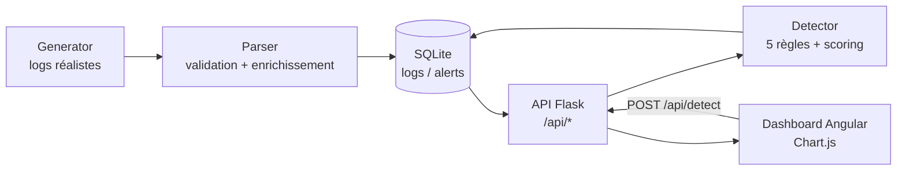
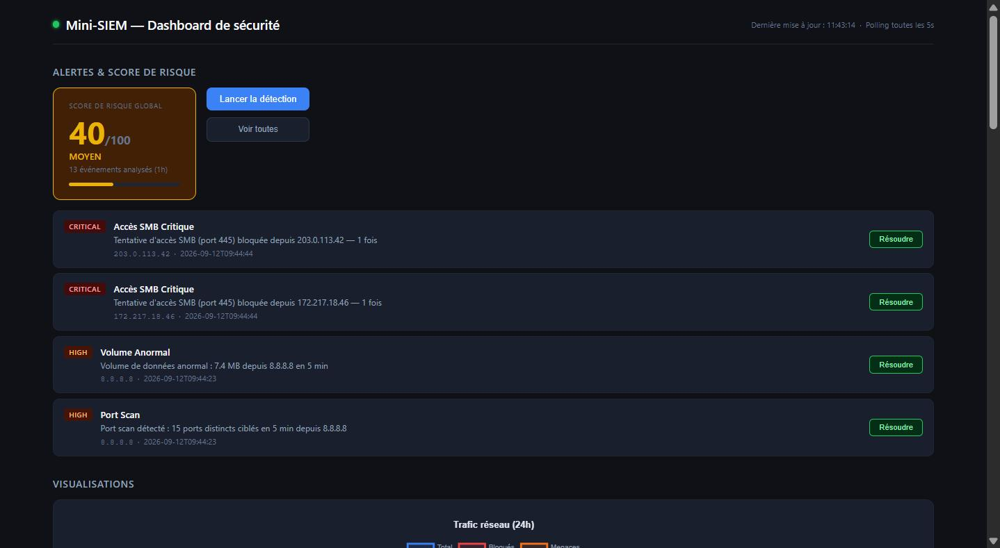

# Mini-SIEM — Système de détection d'intrusion réseau

Projet pédagogique de portfolio cybersécurité : un SIEM (Security Information
and Event Management) simplifié qui ingère des logs réseau, les enrichit,
applique des règles de détection inspirées de cas réels (brute force, scan de
ports, exfiltration, accès à des services critiques, IP malveillantes connues)
et restitue le tout dans un dashboard Angular temps réel.

L'objectif du projet est de démontrer, sur un périmètre volontairement
restreint, des compétences à la fois **SOC/analyse de sécurité** (règles de
détection, scoring de risque, mapping MITRE ATT&CK, rédaction de rapport
d'incident) et **développement full-stack** (API Flask, frontend Angular,
conteneurisation Docker, tests automatisés).

## Architecture



## Stack technique

| Domaine        | Technologies |
|-----------------|--------------|
| Backend         | Python 3.11, Flask 3, Flask-CORS, Gunicorn |
| Base de données | SQLite |
| Frontend        | Angular 21 (standalone components), Chart.js, RxJS |
| Tests           | Pytest (backend), Vitest via `@angular/build:unit-test` (frontend) |
| DevOps          | Docker, Docker Compose, python-dotenv |
| Sécurité        | Détection basée sur règles (IDS-like), scoring de risque, mapping MITRE ATT&CK, clé API |

## Aperçu



## Installation et lancement (Docker Compose)

Prérequis : Docker et Docker Compose.

1. Copier le fichier d'environnement à la racine du projet et adapter les valeurs :
   ```bash
   cp .env.example .env
   ```
   C'est ce fichier `.env` **racine** (à côté de `docker-compose.yml`) que Docker
   Compose lit pour renseigner les variables du service `backend` — éditer
   `backend/.env` n'a aucun effet sur le déploiement Docker (voir plus bas).
   Variables principales :
   - `CORS_ORIGINS` : origines autorisées, séparées par des virgules (défaut `http://localhost:4200`)
   - `API_KEY` : clé requise en header `X-API-Key` pour les endpoints d'écriture — **à changer** avant tout usage partagé
   - `FLASK_DEBUG` : `True`/`False`, ne jamais activer en production

   `PORT` et `DB_PATH` sont fixés directement dans `docker-compose.yml` (respectivement
   `5000` et `/app/data/siem.db`, ce dernier monté depuis `./backend/data`) et ne se
   configurent pas via ce `.env`.

2. Lancer l'ensemble des services :
   ```bash
   docker compose up --build
   ```
   - Backend accessible sur `http://localhost:5000`
   - Frontend accessible sur `http://localhost:4200`
   - Healthcheck backend : `GET http://localhost:5000/api/health`

3. Générer des données de démonstration (optionnel) :
   ```bash
   cd backend && python seed_logs_v2.py
   ```

### Lancement sans Docker

Pour ce mode, la configuration se fait via `backend/.env` (chargé par
`python-dotenv`) plutôt que le `.env` racine :
```bash
cp backend/.env.example backend/.env
```

```bash
# Backend (dev)
cd backend
pip install -r requirements.txt
python app.py

# Backend (production)
gunicorn -w 4 -b 0.0.0.0:5000 app:app

# Frontend
cd frontend
npm install
ng serve
```

### Authentification API

Les endpoints d'écriture (`POST /api/logs`, `POST /api/alerts`, `PATCH
/api/alerts/<id>/resolve`, `DELETE /api/alerts/<id>`, `POST /api/detect`)
exigent un header `X-API-Key` correspondant à la variable d'environnement
`API_KEY`. Une requête sans clé, ou avec une clé invalide, reçoit une réponse
`401 { "error": "..." }`. Les endpoints de lecture (`GET /api/logs`,
`GET /api/alerts`, `GET /api/stats*`, `GET /api/search`) restent ouverts pour
faciliter la démonstration.

Exemple :
```bash
curl -X POST http://localhost:5000/api/detect \
  -H "X-API-Key: change-me" \
  -H "Content-Type: application/json" \
  -d '{"window_minutes": 60}'
```

## Détection & MITRE ATT&CK

Chaque règle de détection est associée à une technique du framework
[MITRE ATT&CK](https://attack.mitre.org/), retournée dans le champ `mitre` de
chaque alerte produite par `POST /api/detect`. Le moteur implémente 5 règles ;
la règle "accès à un service critique" couvre 3 ports (Telnet/SMB/RDP),
détaillés ci-dessous chacun sur sa propre ligne.

| Règle                          | Déclencheur                                             | Sévérité | Technique MITRE ATT&CK |
|---------------------------------|----------------------------------------------------------|----------|--------------------------|
| Brute Force SSH                 | ≥ 5 tentatives DENY sur le port 22 depuis une même IP     | CRITICAL | T1110 — Brute Force (Credential Access) |
| Port Scan                       | ≥ 8 ports distincts DENY depuis une même IP               | HIGH     | T1595 — Active Scanning (Reconnaissance) |
| Volume Anormal (exfiltration)   | > 1 Mo cumulé en ALLOW depuis une même IP                 | HIGH     | T1041 — Exfiltration Over C2 Channel (Exfiltration) |
| Accès Telnet Critique           | DENY sur le port 23 (Telnet)                              | CRITICAL | T1021 — Remote Services (Lateral Movement) |
| Accès SMB Critique              | DENY sur le port 445 (SMB)                                 | CRITICAL | T1021.002 — Remote Services: SMB/Windows Admin Shares |
| Accès RDP Critique              | DENY sur le port 3389 (RDP)                                | CRITICAL | T1021.001 — Remote Services: RDP |
| IP Malveillante Connue          | Trafic observé depuis une IP de la liste `KNOWN_BAD_IPS`   | HIGH     | T1590 — Gather Victim Network Information (Reconnaissance) |

Un exemple complet d'analyse d'incident (alerte Brute Force SSH) est disponible
dans [`docs/rapport-incident-exemple.md`](docs/rapport-incident-exemple.md).

## Tests

```bash
# Backend
cd backend
pytest

# Frontend
cd frontend
ng test
```

## CI/CD

Pipeline GitHub Actions défini dans [`.github/workflows/ci-cd.yml`](.github/workflows/ci-cd.yml).

**Déclencheurs :**
- `push` sur `main` : exécute les tests puis déploie automatiquement
- `pull_request` vers `main` : exécute les tests uniquement (pas de déploiement)

**Jobs :**
1. `backend-tests` — installe les dépendances Python 3.11, lance `pytest` (16 tests)
2. `frontend-tests` — installe les dépendances Node 20, lance `ng test --no-watch` (7 tests)
3. `deploy` — ne s'exécute que si les deux jobs de tests précédents réussissent **et** que le déclencheur est un push sur `main` (pas sur une pull request). Se connecte en SSH à l'instance EC2 cible et exécute `git pull` + `docker compose up -d --build`.

**Cible de déploiement :** une instance EC2 unique (`t2.micro`, Ubuntu 22.04, éligible AWS Free Tier), avec Docker et Docker Compose installés manuellement une fois. Le pipeline ne provisionne pas l'infrastructure (pas de Terraform à ce stade) : il se contente de mettre à jour le code et de reconstruire les conteneurs sur une instance déjà existante, via SSH (action [`appleboy/ssh-action`](https://github.com/appleboy/ssh-action)).

**Secrets GitHub requis** (Settings → Secrets and variables → Actions) :
- `EC2_HOST` — IP publique de l'instance
- `EC2_USER` — utilisateur SSH (`ubuntu`)
- `EC2_SSH_KEY` — clé privée SSH associée à la paire de clés EC2

**Configuration côté serveur :** un fichier `.env` (non versionné, contenant `API_KEY`/`CORS_ORIGINS` propres à l'instance) est présent directement dans `~/app/` sur l'EC2 — il n'est pas géré par le pipeline et doit être créé manuellement lors du premier déploiement.

**Limites actuelles :**
- Une seule instance, sans haute disponibilité ni rollback automatique en cas d'échec du déploiement.
- Pas de registre d'images (le build Docker se fait directement sur l'instance cible).
- Pas de HTTPS/reverse proxy en amont (accès direct sur les ports 4200/5000).

## Kubernetes (Minikube, local)

Manifests dans [`k8s/`](k8s/) — orchestration locale de la même application que le
`docker-compose.yml`, sans lien avec le déploiement EC2/GitHub Actions ci-dessus
(cluster local, pas de cluster managé payant).

**Ressources créées** (vérifiées via `kubectl get pods,svc,deploy,pvc,ingress`) :
- 2 `Deployment` (1 replica chacun) : `backend`, `frontend`
- 2 `Service` ClusterIP : `backend` (5000), `frontend` (80)
- 1 `ConfigMap` (`mini-siem-config`) : variables non sensibles (`PORT`, `DB_PATH`,
  `CORS_ORIGINS`, `FLASK_DEBUG`, `WAZUH_*` non secrets)
- 1 `Secret` (`mini-siem-secret`) : `API_KEY`, `WAZUH_PASSWORD` — **non commité**,
  voir `k8s/secret.example.yaml` comme modèle
- 1 `PersistentVolumeClaim` (`mini-siem-data`, 200 Mi) : stockage du fichier SQLite,
  monté sur `/app/data` dans le pod backend
- 1 `Ingress` (`mini-siem-ingress`, classe `nginx`) : route `/` vers `frontend`,
  `/api` vers `backend`

**Lancer le cluster local :**
```bash
minikube start --driver=docker
minikube addons enable ingress
```

**Construire les images pour Minikube** (le cluster local a son propre registre
d'images, distinct du Docker de l'hôte) :
```bash
docker build -t minisiem-backend:k8s ./backend
docker build -t minisiem-frontend:k8s ./frontend
minikube image load minisiem-backend:k8s
minikube image load minisiem-frontend:k8s
```

**Déployer :**
```bash
# Créer le Secret réel (valeurs propres à l'environnement, jamais commitées)
kubectl create secret generic mini-siem-secret \
  --from-literal=API_KEY=<votre-clé> \
  --from-literal=WAZUH_PASSWORD=<votre-mot-de-passe>

kubectl apply -f k8s/configmap.yaml
kubectl apply -f k8s/backend.yaml
kubectl apply -f k8s/frontend.yaml
kubectl apply -f k8s/ingress.yaml
```

**Accéder à l'application** (le driver Docker de Minikube sur Windows/Mac n'expose
pas directement l'IP du cluster à l'hôte, un tunnel ou port-forward est nécessaire) :
```bash
# Frontend + API via l'Ingress (contrôleur ingress-nginx)
kubectl port-forward -n ingress-nginx svc/ingress-nginx-controller 8080:80
# -> http://localhost:8080/         (frontend)
# -> http://localhost:8080/api/health (backend)

# Ou directement sur les Services, pour reproduire les ports du docker-compose local
kubectl port-forward svc/backend 5000:5000
kubectl port-forward svc/frontend 4200:80
```

**Testé et vérifié le 2026-09-13 :** les deux pods démarrent `Running` (1/1) sans
redémarrage, le `PersistentVolumeClaim` passe à l'état `Bound`, et les trois modes
d'accès ci-dessus renvoient `200` sur `/` et `/api/health`.

**Correction apportée (2026-09-13) :** le frontend appelait initialement une URL
d'API absolue (`http://localhost:5000/api`), ce qui contournait la règle Ingress
`/api`. Corrigé : `environment.prod.ts` utilise désormais une URL relative
(`/api`), et l'image nginx du frontend embarque un reverse proxy
([`frontend/nginx.conf.template`](frontend/nginx.conf.template)) qui relaie
`/api/*` vers le Service `backend:5000` (variable `BACKEND_HOST`, surchageable).
Revérifié : `/api/health` renvoie `200` à la fois via l'Ingress et via le
Service `frontend` accédé directement (sans passer par la règle Ingress `/api`),
confirmant que c'est bien le proxy nginx du pod qui relaie la requête, pas
seulement la route Ingress. Ce même correctif profite aussi au déploiement
EC2/docker-compose (pas d'Ingress là-bas) : le frontend nginx y relaie
désormais aussi `/api` vers le conteneur `backend`, au lieu de dépendre d'un
port 5000 exposé séparément sur l'hôte.

## Infrastructure as Code (Terraform)

Fichiers dans [`terraform/`](terraform/) — reprend en code l'instance EC2 et son
security group jusqu'ici configurés manuellement dans la console AWS (voir
section CI/CD ci-dessus). Ne provisionne pas de VPC dédié : utilise le VPC et le
subnet par défaut du compte, dans les limites du Free Tier (`t3.micro`).

**Ressources gérées :**
- `aws_security_group.mini_siem` — 3 règles ingress explicites : SSH (22),
  API backend (5000), frontend (4200), toutes en `0.0.0.0/0` ; egress ouvert
- `aws_instance.mini_siem` — l'instance EC2 existante (`t3.micro`, Ubuntu,
  volume racine 8 Go gp3)

**Commandes :**
```bash
cd terraform
terraform init
terraform plan
terraform apply
```

**Comment c'est vérifié (fait le 2026-09-13) :** l'instance et le security group
existants (créés manuellement avant cette étape) ont été importés dans l'état
Terraform via `terraform import` (`aws_instance.mini_siem`,
`aws_security_group.mini_siem`), pour que le code reflète l'infra réelle sans la
recréer. Un premier `terraform plan` a révélé une règle ingress port 80 inutilisée
(héritée de la configuration manuelle initiale, jamais utilisée par
l'application qui écoute sur 4200/5000) ; `terraform apply` l'a supprimée et a
ajouté des descriptions explicites aux règles restantes — **0 ressource ajoutée,
1 modifiée (mise à jour en place, sans remplacement), 0 détruite**. Un
`terraform plan` exécuté juste après confirme `No changes. Your infrastructure
matches the configuration.` L'application est restée accessible tout du long
(`/api/health` et le frontend ont continué à répondre `200` pendant et après
l'apply) et le port 80 est bien fermé (`connection timeout` vérifié après coup).

**Limites actuelles :**
- Le nom et l'AMI/subnet de l'instance sont volontairement figés sur les valeurs
  déjà existantes (les changer forcerait Terraform à recréer la ressource) —
  ce n'est donc pas encore un module 100 % reproductible from scratch sur un
  compte AWS vierge sans adaptation des variables.
- Pas de backend d'état distant (le fichier `terraform.tfstate` reste local,
  non commité — voir `.gitignore`) : pas de state partagé en équipe à ce stade.
- Les credentials AWS (clé root du compte, faute d'utilisateur IAM dédié à ce
  stade) sont configurés localement via `aws configure`, jamais commités.

## Monitoring (Prometheus + Grafana, sur le même cluster Minikube)

Manifests dans [`k8s/monitoring/`](k8s/monitoring/) — déployés sur le cluster
Minikube utilisé pour l'orchestration Kubernetes ci-dessus (aucun lien avec
l'EC2/Terraform : monitoring local uniquement à ce stade).

**Backend instrumenté** ([`backend/metrics.py`](backend/metrics.py), lib.
`prometheus-client`) — endpoint `GET /metrics` exposant :
- `http_requests_total{method,endpoint,status}` — compteur de requêtes HTTP
- `http_request_duration_seconds{method,endpoint}` — histogramme de latence
- `alerts_generated_total{rule_name,severity}` — compteur d'alertes produites
  par le moteur de détection, incrémenté à chaque `POST /api/detect`

**Ressources créées :**
- 1 `Deployment` + `Service` Prometheus (port 9090), config via `ConfigMap`
  (scrape du `Service` `backend` sur `/metrics`, règles d'alerte incluses)
- 1 `Deployment` + `Service` Grafana (port 3000), avec provisioning automatique
  (via `ConfigMap`) d'une datasource Prometheus et d'un dashboard "Mini-SIEM"
- 1 `Secret` (`grafana-admin`) pour le mot de passe admin Grafana — non commité

**Dashboard Grafana "Mini-SIEM"** (4 panels, provisionnés automatiquement) :
requêtes HTTP/s par endpoint, latence p95, alertes générées cumulées par règle,
statut `up` du backend.

**Alertes Prometheus configurées** (`k8s/monitoring/prometheus-config.yaml`) :
- `BackendDown` — `up{job="backend"} == 0` pendant 30s
- `HighCriticalAlertRate` — plus de 3 alertes CRITICAL sur 5 minutes

**Déployer :**
```bash
kubectl create secret generic grafana-admin --from-literal=password=<votre-mdp>
kubectl apply -f k8s/monitoring/prometheus-config.yaml
kubectl apply -f k8s/monitoring/prometheus.yaml
kubectl apply -f k8s/monitoring/grafana-provisioning.yaml
kubectl apply -f k8s/monitoring/grafana.yaml
```

**Accéder :**
```bash
kubectl port-forward svc/prometheus 9090:9090   # http://localhost:9090
kubectl port-forward svc/grafana 3000:3000      # http://localhost:3000 (admin / <votre-mdp>)
```

**Testé et vérifié le 2026-09-13 :**
- `GET /metrics` sur le backend renvoie bien les 3 métriques ci-dessus
- Prometheus scrape le backend avec succès (`up{job="backend"} == 1`, cible
  `health: up` dans `/api/v1/targets`)
- Après avoir mis le backend à l'échelle 0 (`kubectl scale deploy/backend
  --replicas=0`), la règle `BackendDown` est passée de `inactive` → `pending`
  → **`firing`** en ~50s (30s de `for:` + latence de scrape), confirmée via
  `/api/v1/rules` — puis revenue à `inactive` après remise à l'échelle
- La datasource Prometheus et le dashboard "Mini-SIEM" apparaissent bien dans
  l'API Grafana (`/api/datasources`, `/api/search`)
- Après injection de logs de brute-force SSH + `POST /api/detect`, la requête
  PromQL `sum by (rule_name) (alerts_generated_total)` renvoie une valeur réelle
  (`Brute Force SSH: 1`) — confirmant que le panel correspondant du dashboard
  affiche des données, pas un graphe vide

**Stockage persistant (ajouté le 2026-09-13) :** Prometheus utilise désormais un
`PersistentVolumeClaim` (`prometheus-data`, 1 Gi) monté sur `/prometheus`, avec
`fsGroup: 65534` pour que le process non-root du conteneur puisse y écrire.
Vérifié : suppression manuelle du pod (`kubectl delete pod -l app=prometheus`)
→ le nouveau pod recréé par le Deployment retrouve les mêmes fichiers WAL
(`ls /prometheus/wal` identique avant/après), confirmant que l'historique des
métriques survit bien à un redémarrage.

**Limites actuelles :**
- Pas d'Alertmanager déployé : les règles Prometheus passent bien à `firing`
  (visible dans l'UI Prometheus), mais aucune notification n'est envoyée
  (email/Slack) — ce serait l'étape suivante pour une alerte "actionnable".
- Dashboard limité à 4 panels de base ; pas encore de vue dédiée par règle de
  détection ou par IP source.

## Limites connues

Ce projet est **pédagogique** et n'est pas destiné à un usage en production :
- Les logs sont générés/simulés (ou saisis via l'API) — il n'y a pas de vraie
  ingestion réseau (pas d'agent, pas de capture de trafic, pas de syslog).
- Les règles de détection sont simples (seuils fixes, fenêtre glissante) et
  ne remplacent pas un moteur de corrélation avancé.
- SQLite n'est pas conçu pour de forts volumes ou de la concurrence élevée.
- L'authentification est une clé API unique partagée, sans gestion
  d'utilisateurs, de rôles ni de rotation automatique.
- Pas de chiffrement TLS configuré par défaut (à ajouter via un reverse proxy
  en déploiement réel).
- Le frontend appelle directement l'API backend exposée sur son port ; il n'y
  a pas de reverse proxy nginx pour `/api` dans l'image frontend actuelle.

## Pistes d'évolution

- Intégration à un vrai SIEM/EDR (Wazuh, ELK/Elastic Security) pour une
  ingestion et une corrélation à l'échelle.
- Alerting temps réel via WebSockets ou Server-Sent Events plutôt que du
  polling côté frontend.
- Migration vers une base de données plus robuste (PostgreSQL, éventuellement
  TimescaleDB pour les séries temporelles).
- Authentification utilisateur multi-rôle (analyste / admin) avec JWT plutôt
  qu'une clé API partagée.
- Détection par apprentissage automatique (anomalies statistiques) en
  complément des règles à seuils fixes.
- Enrichissement des IP par des flux de threat intelligence externes
  (réputation, géolocalisation) au lieu d'une liste statique.
